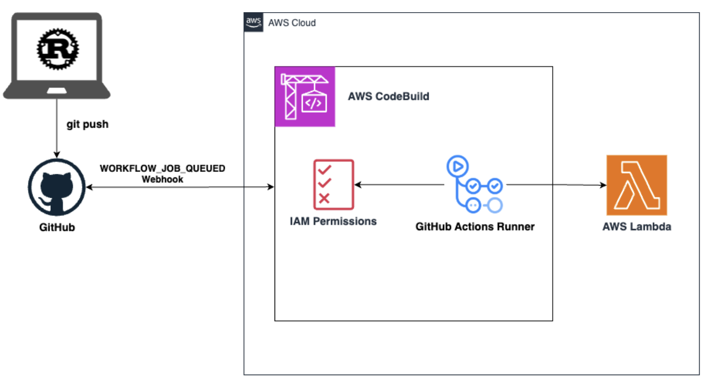
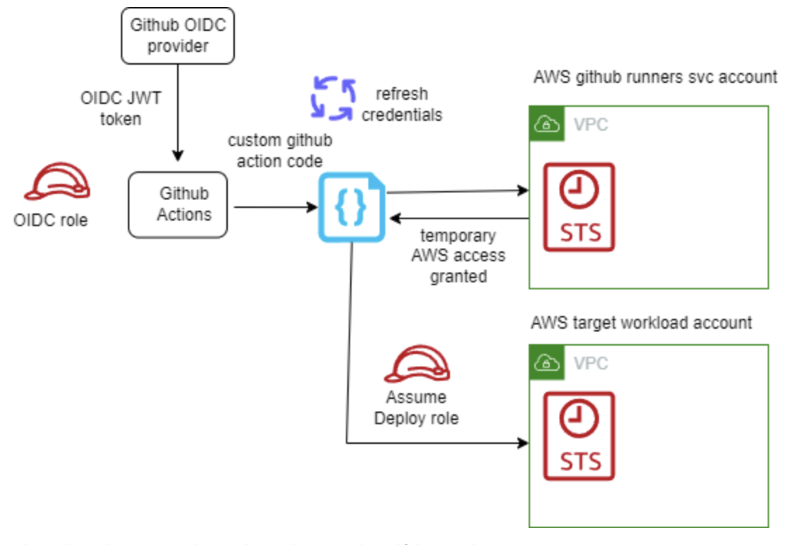

# Lambda Ephemeral Github Runners lab

This following the AWS new solution on CodeBuild runners:

Alternative: This is following the AWS best practices as seen here: https://aws.amazon.com/blogs/devops/best-practices-working-with-self-hosted-github-action-runners-at-scale-on-aws/

